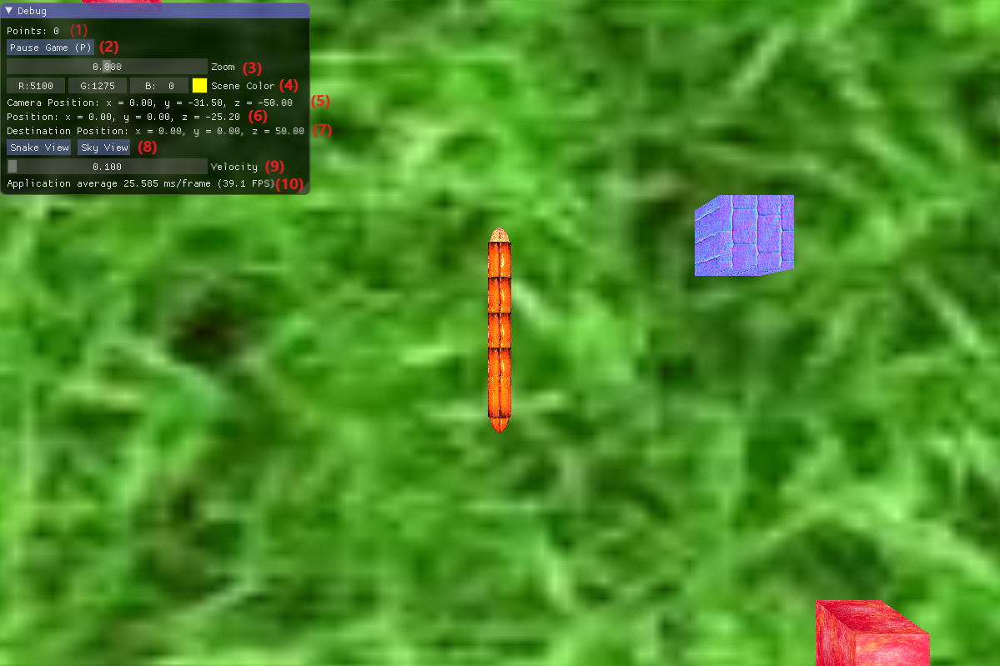

# 3D-Snake
Final Project for Video Games Programming course

### Installing

Download the solution folder and open the "Snake3D.sln" file.
Rebuild Solution in Debug mode and Run the program.

## Game feature

### Interface

### Movement around the scene
  ** LEFT_ARROW and RIGHT_ARROW are for turning the head of the snake
  ** UP_ARRON and DOWN_ARROW are for moving towards/away from floor.
  ** W/S/A/D KEYs are for moving the whole snake in the X-Y plane (on the floor)

