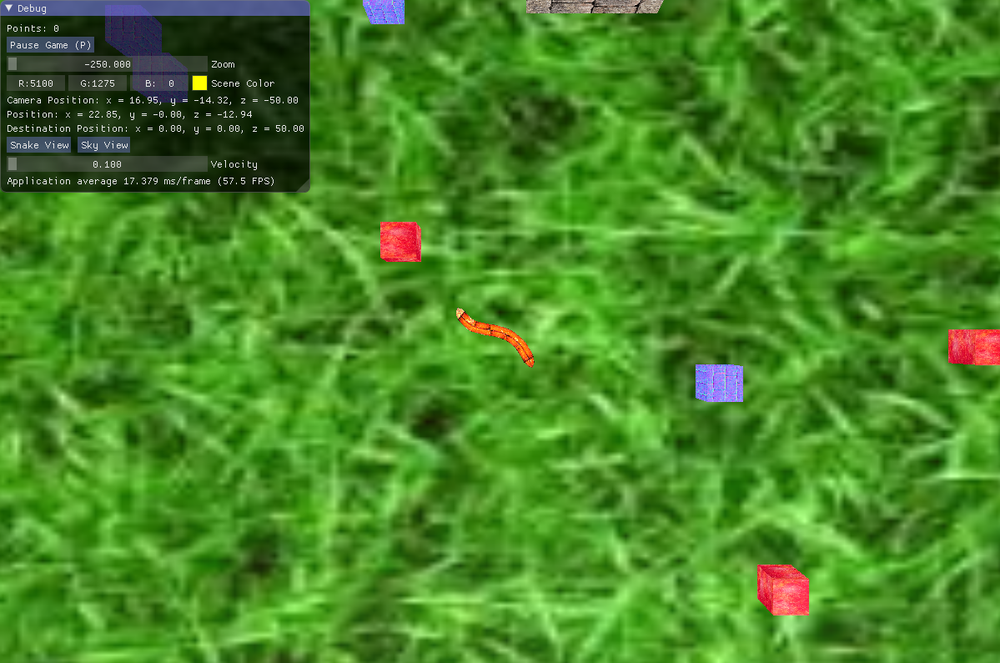

# 3D-Snake

Final Project for Video Games Programming course.

### Installing

Download the solution folder and open the "Snake3D.sln" file.
Rebuild Solution in Debug mode and Run the program.

## Game features

### Interface

First view of the game:

1. Points counter - each time you eat an "apple" you get 10 points.
2. Pause Game button - pauses the game (also available with P_KEY)
3. Zoom - zoom in and of with the camera view.
4. Scene Color - shows the color of the scene light -
the color could be changed with the circle of color around the middle arrow.

5. Sky view camera position.
6. Position of the snake.
7. Destination position (the position to which the snake is moving using the FABRIK algorithm).
8.1 Snake View button - shows the view from the snakes point of view.

8.2 Sky View button - shows the view from above the snake.

9. Velocity - control the speed of the snake.
10. FPS indicator.

### Movement around the scene
  * LEFT_ARROW and RIGHT_ARROW are for turning the head of the snake.
  * UP_ARRON and DOWN_ARROW are for moving towards/away from floor.
  * W/S/A/D KEYs are for moving the snake in the X-Y plane (on the floor).
 
### Game scene components
  * Grass floor.
  * Walls around the grass (to keep the snake from falling down of course!).
  * Blue obstacles - be careful, don't hit them!
  * Apples - help the snake to score some points to compare with his buddies in the cave.
  * The Cave - the ultimate Bachelor Pad.
